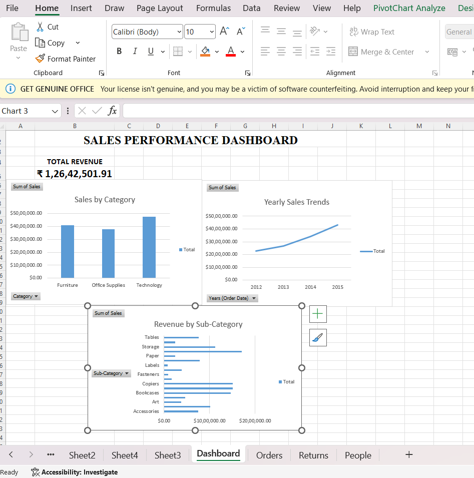

# Sales Performance Pivot Table Dashboard

## Project Overview

This project presents an interactive Sales Performance Dashboard created using Microsoft Excel Pivot Tables and Charts.

The dashboard is designed to analyze sales performance and provide a clear visual summary of revenue across different categories, years, and departments/sub-categories.

## Project Objectives

The main objectives of this project are:

- Analyze Total Revenue
- Analyze Sales by Category
- Identify Yearly Sales Trends
- Analyze Department-wise Revenue
- Present sales performance using interactive Pivot Charts

## Dashboard Features

### 1. Total Revenue
Displays the overall revenue generated from the sales data.

### 2. Sales by Category
Shows sales performance across different product categories such as Furniture, Office Supplies, and Technology.

### 3. Yearly Sales Trends
A line chart showing how sales revenue changed over different years.

### 4. Department-wise Revenue
Shows revenue distribution across the available department/sub-category data.

## Tools Used

- Microsoft Excel
- Pivot Tables
- Pivot Charts
- Excel Dashboard
- Data Analysis

## Key Insights

The dashboard provides a visual comparison of:

- Overall revenue performance
- Category-wise sales contribution
- Year-over-year sales growth
- Revenue contribution by department/sub-category

## Project File

The complete Excel dashboard is available in:

`Sales_Performance_Pivot_Dashboard.xlsx`

## Dashboard Preview

## Conclusion

This project demonstrates how Excel Pivot Tables and Pivot Charts can be used to transform raw sales data into an interactive and easy-to-understand business dashboard.
